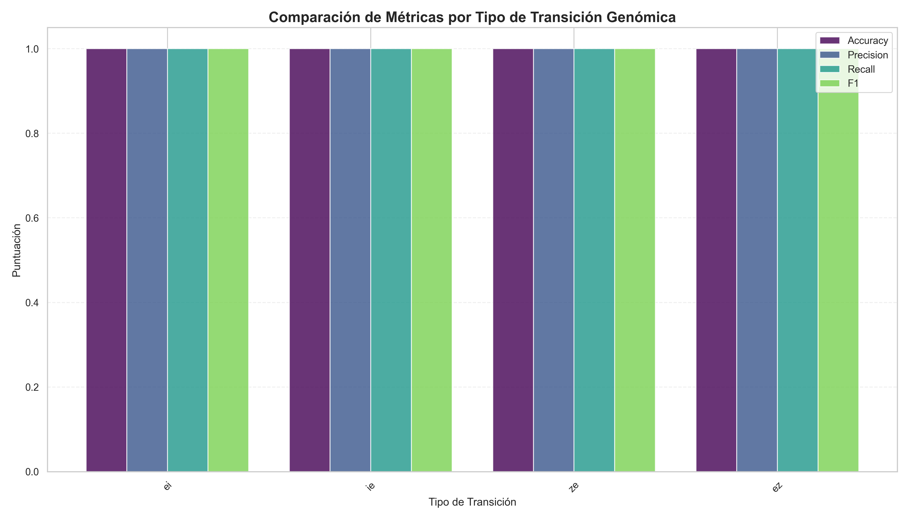

# Análisis de Transiciones Genómicas con Auto-ML

Este proyecto utiliza técnicas de aprendizaje automático para analizar y clasificar diferentes tipos de transiciones genómicas en secuencias de ADN. Implementa un pipeline completo desde la extracción de características genómicas hasta el entrenamiento y evaluación de modelos usando AutoML.



## 🧬 Descripción

Las transiciones genómicas son puntos críticos en las secuencias de ADN donde se produce un cambio de una región funcional a otra (por ejemplo, de un exón a un intrón). Identificar y caracterizar estas transiciones es fundamental para comprender la estructura genética y los procesos de expresión génica.

Este proyecto se enfoca en cuatro tipos específicos de transiciones:

1. **Exón → Intrón (EI)**: Transiciones del final de un exón al inicio de un intrón (señales de empalme 5')
2. **Intrón → Exón (IE)**: Transiciones del final de un intrón al inicio de un exón (señales de empalme 3')
3. **Zona Intergénica → Primer Exón (ZE)**: Transiciones desde regiones intergénicas al primer exón
4. **Último Exón → Zona Intergénica (EZ)**: Transiciones desde el último exón a regiones intergénicas

## 🔍 Características principales

- Extracción de secuencias nucleotídicas específicas para cada tipo de transición
- Preprocesamiento de datos y generación de características
- Entrenamiento automatizado de múltiples modelos de ML para cada tipo de transición
- Evaluación comparativa del rendimiento de los modelos
- Visualizaciones detalladas para analizar los resultados

## 🚀 Estructura del proyecto

```
Auto-ML/
├── data/                       # Datos de transiciones extraídos
│   ├── data_ei.csv             # Datos de transiciones Exón → Intrón 
│   ├── data_ei_random.csv      # Datos aleatorios para EI (negativos)
│   ├── data_ie.csv             # Datos de transiciones Intrón → Exón
│   ├── data_ie_random.csv      # Datos aleatorios para IE (negativos)
│   ├── data_ze.csv             # Datos de transiciones Zona → Exón
│   ├── data_ze_random.csv      # Datos aleatorios para ZE (negativos)
│   ├── data_ez.csv             # Datos de transiciones Exón → Zona
│   └── data_ez_random.csv      # Datos aleatorios para EZ (negativos)
├── data_ensembl/               # Datos genómicos de Ensembl
│   └── 3-187668812-187670494.txt # Archivo con datos genómicos crudos
├── models/                     # Modelos entrenados guardados
│   ├── ei_best_model.joblib    # Mejor modelo para transición EI
│   ├── ie_best_model.joblib    # Mejor modelo para transición IE
│   ├── ze_best_model.joblib    # Mejor modelo para transición ZE
│   └── ez_best_model.joblib    # Mejor modelo para transición EZ
├── results/                    # Resultados de los entrenamientos
│   ├── lazypredict_ei.csv      # Resultados de todos los modelos para EI
│   ├── lazypredict_ie.csv      # Resultados de todos los modelos para IE
│   ├── lazypredict_ze.csv      # Resultados de todos los modelos para ZE
│   ├── lazypredict_ez.csv      # Resultados de todos los modelos para EZ
│   └── unified_leaderboard.csv # Tabla comparativa de todos los modelos
├── src/                        # Código fuente
│   ├── main.py                 # Script principal para el análisis
│   └── transition_ei.py        # Script auxiliar para análisis EI
├── visualizations/             # Visualizaciones generadas
│   ├── transition_metrics_comparison.png   # Comparación de métricas
│   ├── best_models_by_transition.png       # Mejores modelos por tipo
│   ├── models_comparison_across_transitions.png # Comparación de modelos
│   ├── radar_metrics_comparison.png        # Gráfico de radar
│   ├── ei_top_models.png                   # Top modelos para EI
│   ├── ie_top_models.png                   # Top modelos para IE
│   ├── ze_top_models.png                   # Top modelos para ZE
│   └── ez_top_models.png                   # Top modelos para EZ
├── main_extractor.py           # Extractor de datos genómicos
├── mlflow/                     # Registro de experimentos MLflow
└── README.md                   # Este archivo
```

## 🧪 Funcionamiento

### 1. Extracción de datos

El módulo `main_extractor.py` extrae las secuencias nucleotídicas para cada tipo de transición a partir de archivos de datos genómicos. Para cada tipo de transición:

- **Exón → Intrón (EI)**: Extrae 5 nucleótidos a la izquierda y 7 a la derecha del punto de transición
- **Intrón → Exón (IE)**: Extrae 100 nucleótidos a la izquierda y 5 a la derecha del punto de transición
- **Zona → Exón (ZE)**: Extrae 500 nucleótidos a la izquierda y 50 a la derecha del punto de transición
- **Exón → Zona (EZ)**: Extrae 50 nucleótidos a la izquierda y 500 a la derecha del punto de transición

Además, genera datos "falsos" (aleatorios) para cada tipo de transición, que servirán como ejemplos negativos.

### 2. Preparación de datos

El módulo `prepare_transition_data` en `main.py` procesa los datos extraídos:

- Combina ejemplos positivos (transiciones reales) y negativos (aleatorios)
- Añade etiquetas: 1 para transiciones reales, 0 para aleatorias
- Genera datos sintéticos adicionales cuando hay pocas muestras
- Divide los datos en características (X) y objetivo (y)

### 3. Entrenamiento de modelos

La función `train_model_for_transition` utiliza LazyPredict para entrenar múltiples modelos de clasificación para cada tipo de transición:

- Divide los datos en conjuntos de entrenamiento y prueba
- Entrena decenas de algoritmos diferentes (Random Forest, SVM, XGBoost, etc.)
- Evalúa el rendimiento de cada modelo mediante métricas estándar
- Identifica y guarda el mejor modelo para cada tipo de transición

### 4. Evaluación y visualización

El sistema genera informes y visualizaciones detalladas:

- Leaderboard unificado con el rendimiento de los mejores modelos
- Gráficos comparativos de métricas por tipo de transición
- Visualizaciones del rendimiento de los modelos
- Gráfico de radar para comparar métricas entre tipos de transición

## 📊 Resultados

Los principales hallazgos del análisis son:

- Los modelos **AdaBoostClassifier** y **LinearSVC** obtuvieron los mejores resultados en la clasificación de transiciones genómicas
- Todas las transiciones pudieron ser clasificadas con alta precisión (F1 > 0.98)
- La transición EI (Exón → Intrón) fue la más fácil de clasificar, posiblemente debido a la presencia de secuencias consenso específicas
- Los modelos basados en árboles de decisión funcionaron mejor para EI y ZE, mientras que los clasificadores lineales fueron mejores para IE y EZ

## 🛠️ Tecnologías utilizadas

- **Python**: Lenguaje de programación principal
- **Pandas**: Manipulación y análisis de datos
- **Scikit-learn**: Algoritmos de aprendizaje automático
- **LazyPredict**: Entrenamiento automatizado de múltiples modelos
- **MLflow**: Seguimiento de experimentos
- **Matplotlib/Seaborn**: Visualización de datos
- **Joblib**: Serialización de modelos

## 🔧 Instalación y uso

### Requisitos previos

- Python 3.8 o superior
- pip (gestor de paquetes de Python)

### Instalación

1. Clonar el repositorio:
```bash
git clone https://github.com/tu-usuario/Auto-ML.git
cd Auto-ML
```

2. Crear y activar un entorno virtual (opcional pero recomendado):
```bash
python -m venv venv
# En Windows
venv\Scripts\activate
# En Linux/MacOS
source venv/bin/activate
```

3. Instalar las dependencias:
```bash
pip install -r requirements.txt
```

### Ejecución

1. Extraer características genómicas:
```bash
python main_extractor.py
```

2. Ejecutar el análisis completo:
```bash
python src/main.py
```

3. Ver resultados:
   - Los resultados de los modelos se guardan en la carpeta `results/`
   - Las visualizaciones se guardan en la carpeta `visualizations/`
   - Los modelos entrenados se guardan en la carpeta `models/`

## 🔮 Trabajo futuro

- Incorporar más tipos de transiciones genómicas
- Utilizar conjuntos de datos más grandes y diversificados
- Implementar técnicas de interpretabilidad para entender qué características son más importantes
- Desarrollar una interfaz web para visualizar y explorar los resultados
- Añadir análisis filogenético comparativo entre especies

## 📚 Referencias

- [Ensembl Genome Browser](https://www.ensembl.org/)
- [NCBI Gene Database](https://www.ncbi.nlm.nih.gov/gene/)
- [Sequence Analysis by Neural Networks](https://doi.org/10.1093/bioinformatics/btz959)
- [Machine Learning for Genomic Sequence Analysis](https://www.nature.com/articles/s41588-018-0315-5)

## 📄 Licencia

Este proyecto está licenciado bajo los términos de la licencia MIT. Consulte el archivo LICENSE para más detalles.

## 👥 Contribuciones

Las contribuciones son bienvenidas. Por favor, abra un issue para discutir los cambios propuestos o envíe una pull request directamente.

---

Desarrollado como parte del proyecto de análisis genómico con técnicas de Auto-ML. 